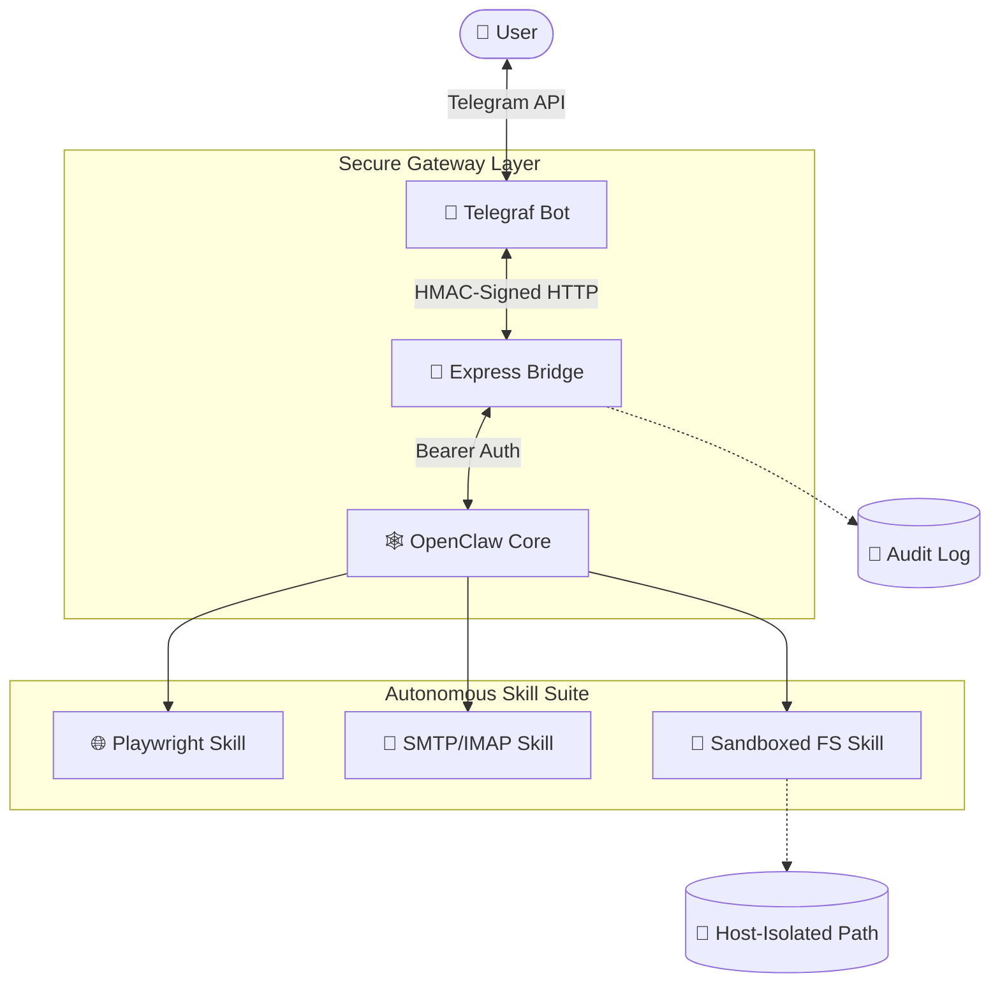

# 🤖 OpenClaw Sentinel: Security-Hardened Autonomous Agent Bridge

[]()
[]()
[]()
[]()

**OpenClaw Sentinel** is a security-first extension of the OpenClaw framework, designed to deploy autonomous AI agents in production environments. It bridges the gap between raw LLM intelligence and real-world execution through a hardened Telegram interface, featuring custom toolkits and a zero-trust communication layer.

---

## 🎯 Project Vision
This project demonstrates how to build **controllable and auditable** AI agents. Unlike simple wrappers, this system enforces strict security boundaries, ensures all actions are logged, and provides a multi-provider strategy (NVIDIA NIM, Groq, OpenAI) to avoid vendor lock-in.

---

## 🏗️ Technical Architecture



---

## 🛡️ Core Technical Innovations

### 1. Zero-Trust Communication
All inter-service traffic between the Telegram Bot and the Backend is protected by **HMAC-SHA256 request signing**. This ensures:
- **Integrity**: Payloads cannot be tampered with in transit.
- **Authenticity**: Only the authorized bot client can trigger actions.
- **Replay Protection**: Requests expire after 5 minutes based on an encrypted timestamp.

### 2. Sandboxed Skill Execution
The **Workspace Skill** implements a multi-stage path validation engine to prevent Directory Traversal attacks:
- **Input Sanitization**: Rejects any path containing `..`.
- **Absolute Resolution**: Resolves paths to the physical disk location.
- **Prefix Guarding**: Ensures the final path resides strictly within the `/workspace` mount.
- **Symlink Protection**: Uses `realpathSync` to block links that point outside the sandbox.

### 3. Multi-Provider LLM Agnostic
The system is built to be model-agnostic. By modifying the `.env`, the agent can switch between:
- **NVIDIA NIM**: For high-performance, self-hosted or cloud inference.
- **Groq**: For ultra-low latency Llama-3 execution.
- **OpenAI**: For industry-standard GPT-4o capabilities.

---

## 🚀 Skills & Toolsets

| Skill | Technical Stack | Description |
|:---:|:---:|---|
| **Browser** | Playwright (Headless) | Enables the agent to search the web, analyze DOM structures, and capture screenshots for visual verification. |
| **Email** | Nodemailer / Imapflow | Secure SMTP/IMAP integration allowing the agent to send reports and summarize inbox threads autonomously. |
| **Workspace** | Node.js `fs` + Sandbox | A set of 12 atomic file operations (Read, Write, Search, etc.) designed for data persistence and document management. |

---

## 📊 Observability & Auditing
Every interaction is recorded in a production-ready **Audit Log**. This is critical for mentoring and debugging agentic behavior:
- **Prompt Tracking**: Records raw user input vs. tool output.
- **Performance Metrics**: Tracks `responseTime` and `toolUsed` for each request.
- **Security Logs**: Captures unauthorized access attempts (Blocked Status).

---

## ⚡ Quick Deployment

### 1. Environment Setup
```bash
chmod +x setup.sh && ./setup.sh
```

### 2. Configure Credentials
Edit `.env` to set your provider and security tokens:
```bash
# Example: Select NVIDIA NIM
NVIDIA_API_KEY=nvapi-xxxx
OPENCLAW_MODEL=nvidia_nim/z-ai/glm4.7

# Generate Security Tokens
openssl rand -hex 32 # SHARED_SECRET
```

### 3. Start Infrastructure
```bash
docker compose up --build -d
```

---

## 📂 Project Structure
```text
├── bridge/            # Telegram ↔ Core Middleware (HMAC Layer)
├── custom-skills/     # Custom implementation of the OpenClaw protocol
│   ├── browser-skill/ # Headless web analysis
│   ├── email-skill/   # SMTP/IMAP operations
│   └── workspace-skill/# Sandboxed filesystem
├── workspace/         # Isolated data volume for the agent
├── openclaw-config/   # Dynamic provider configuration
└── audit_log.json     # Permanent execution record
```

---
<p align="center">OpenClaw Sentinel | Built for performance. Hardened for security.</p>
